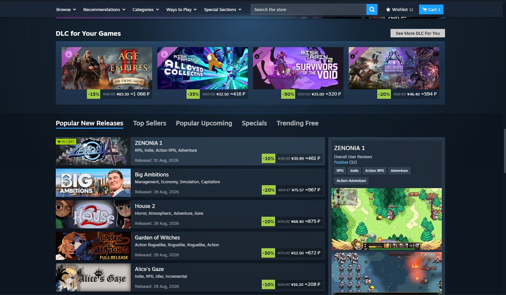

# Steam Currency Converter

**English** · [Русский](README.ru.md)

A [Millennium](https://steambrew.app) plugin: shows an **approximate price in the currency you pick** next to any Steam price — store, cart, checkout, community market, and the in-game overlay.

> This is an approximate exchange-rate conversion, **not** an official Steam regional price.



Fork of [KuroKim/steam-currency-to-rub](https://github.com/KuroKim/steam-currency-to-rub).

---

## Features

- **target currency is selectable** in the plugin settings (Millennium → Settings → Plugins → Steam Currency Converter); RUB by default;
- detects the account's wallet currency automatically (wallet id → schema.org markup → store formatter);
- supports all 40 Steam wallet currencies as both source and target
  (USD, EUR, GBP, CHF, PLN, BRL, JPY, NOK, IDR, MYR, PHP, SGD, THB, VND, KRW, TRY,
  UAH, MXN, CAD, AUD, CNY, INR, CLP, PEN, COP, ZAR, HKD, TWD, SAR, AED, SEK, ARS,
  ILS, BYN, KZT, KWD, QAR, CRC, UYU, NZD);
- format-agnostic price parsing: `1,234.56`, `1.234,56`, `1 199`, zero-decimal currencies;
- works in the cart and checkout (including the new React UI) and the overlay;
- exchange rates cached for 6 hours, falls back to the last cache when offline; three sources with automatic failover;
- DOM-only rendering (`createElement` / `textContent`) — no `innerHTML`, no `eval`, no remote code.

A currency change takes effect after Steam is restarted.

---

## Install

### One line (PowerShell)

```powershell
irm https://raw.githubusercontent.com/Jidos86/steam-currency-converter/main/scripts/web-install.ps1 | iex
```

Installs [Millennium](https://steambrew.app) first if it's missing (downloads the
official release, verifies its checksum, extracts into the Steam folder), then
the plugin — enabled and ready after Steam restarts.

### Manually

1. Install [Millennium](https://steambrew.app).
2. Download the prebuilt `steam-currency-converter.zip` from the Releases tab.
3. Extract into `…\Steam\millennium\plugins\` → `…\plugins\steam-currency-converter\plugin.json`.
4. Millennium → Settings → Plugins → enable **Steam Currency Converter**.
5. Fully restart Steam.

### Uninstall

```powershell
powershell -ExecutionPolicy Bypass -File .\scripts\uninstall.ps1
```

---

## How it works

Three parts, built with `@steambrew/ttc`:

| part | role |
|---|---|
| `webkit/` | injected into Steam pages with `Page.setBypassCSP` (so it works even where the store CSP blocks external `<script>`, e.g. the Steam China store); fetches rates from [currency-api](https://github.com/fawazahmed0/exchange-api), detects the wallet currency, scans price nodes (+ a MutationObserver, + an extra pass on `/cart` and `/checkout`) and appends `≈ N <cur>` |
| `frontend/` | the settings panel with the currency dropdown |
| `backend/main.lua` | stores the chosen currency (`millennium.config`) and hands it to the webkit module and the panel via `callable` |

---

## Development

```bash
npm install
npm run build      # millennium-ttc → .millennium/Dist/{index.js,webkit.js}
npm run typecheck
```

```powershell
powershell -ExecutionPolicy Bypass -File .\scripts\dev-link.ps1   # symlink the repo into the Millennium plugins dir
```

```text
plugin.json                  Millennium manifest
frontend/index.tsx           settings panel
webkit/index.tsx             the converter (injected into Steam pages)
backend/main.lua             stores the chosen currency
scripts/                     install / uninstall / dev-link / web-install
.github/workflows/ci.yml     typecheck → build → luaparse → zip (release on v* tags)
```

`.millennium/` and `node_modules/` are build output and are not committed.

---

## Credits

- Original plugin — [KuroKim](https://github.com/KuroKim/steam-currency-to-rub).
- Original userscript — [CJMAXiK](https://gist.github.com/cjmaxik/7ce493d08958eecd56a78c01482e49fa) (MIT).
- Exchange rates — [@fawazahmed0/exchange-api](https://github.com/fawazahmed0/exchange-api).

Not affiliated with Valve or Millennium / Steambrew. Unofficial plugin. MIT licensed.
